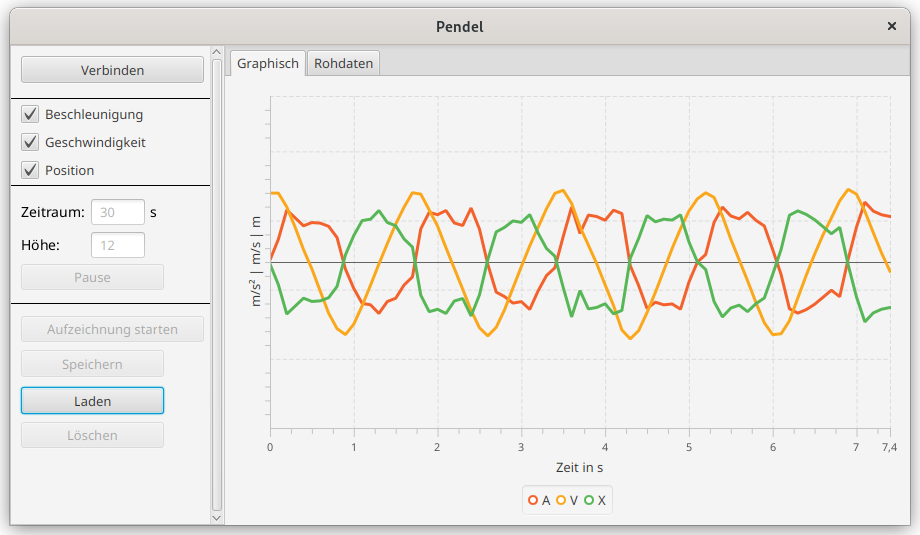

# Pendulum

Made for visualization of the forces of a pendulum. Connects Arduino attached to the pendulum and a gyrosensor via Wi-Fi to the Java Application.

## Photon

Photon is a Arduino with a Wi-Fi chip on board. The code works with a Mpu6050 gyrosensor.

## Java

Desktop application which can connect to the Photon.
With the application it is possible to visualize the position, speed and velocity as well as the recording fo them.
The package `de.secretj12.Pendel` contains all the necessary code for the connection and can be reused to obtain
a connection to the pendulum as needed.

Documentation is only available in german as it was a school project.

The application can be started using the following command.
```bash
mvn clean javafx:run
```

Example picture of the application.
Seems like i missed to take some fancy screenshots, there have been way better results.
